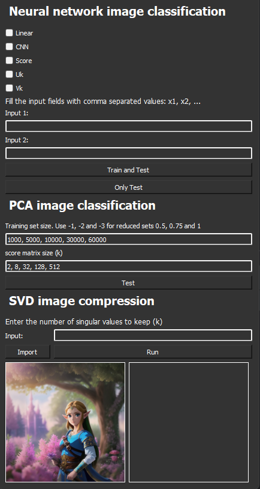

# Machine learning for image recognition using Neural Networks and PCA

## Installation
Clone the project and install the requirements to your environment:

`git clone https://github.com/albined/kandidatarbete-ML.git`

`pip install -r requirements.txt`

Then run **[main.py](main.py)** to start the program.

## Usage

Run the file **[main.py](main.py)** to start the program. 

### Neural network image classification
- Select the test you want to perform in the checkbox
- Edit the input fields to select which values you want to evaluate
  - The inputs should be given as a list of integers separated by commas
- Click on _**Train and Test**_ to train a neural network with the selected values. A plot will show up once the process is 
complete. Tables with the results can also be found in `/pca_image_classification/results`
- _**Only test**_ will only retest the models and will not repeform the training stage

### PCA image classification
- select the desired training set sizes and score matrix sizes for the test
- click on _**Test**_ to run the test. 
  - the Training set size can at a maximum be 60000
  - -1, -2 and -3 correspond to the reduced training set sizes 0.5, 0.75 and 1 respectively

### SVD image compression
- Enter the number of singular values to keep after compressing in the input field
- Import the image you want to compress with the _**Import**_ button
- Click on _**Run**_ to perform the test
  - The output will be shown in the second image box once it's been computed

## Authors and acknowledgment
This Git repository was created by Albin Edegran, Bekir Fazlija, Joel Carlsson,
Enya Arvidsson and Hannes Björck as part of our kandidatarbete at Chalmers.
We would like to express our gratitude 
to our professor and teacher Larisa Beilina for her guidance and support
throughout the project. 

## License
This project is licensed under the MIT License. See [LICENSE.txt](LICENSE.txt) for details. 
